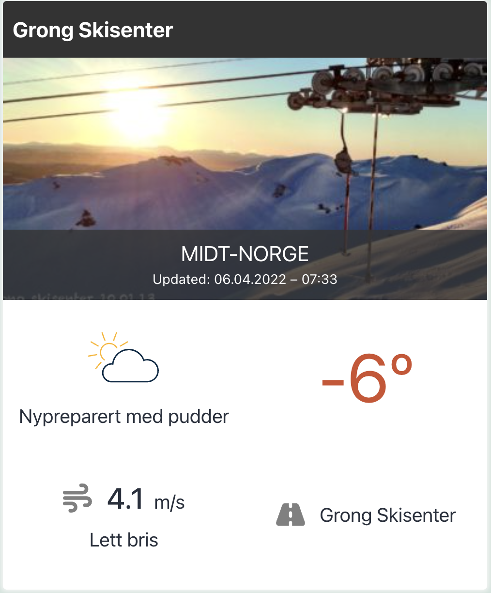

# Ski Resort Block 
WordPress Plugin that enable an Gutenberg Block which allows the user to search with autocomplete some resort in the FnuggAPI.

After the user selects some resort and save, the front should render a card with the info from the selected resort, e.g:

## Installation
1. Upload the plugin files to the `/wp-content/plugins/ski-resort-block` directory, or install the plugin through the WordPress plugins screen directly.
1. Activate the plugin through the 'Plugins' screen in WordPress

## To do 
- [ ] Error messages when some error ocours
- [ ] Possibility to change colors and backgrounds on the card content
- [ ] Implement tests (unit and integration)